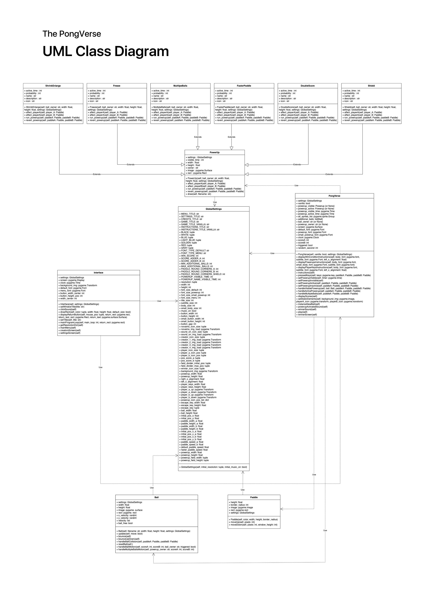

# The PongVerse 🎮

A new type of Pong game inspired by Marvel World and created with Pygame!

The PongVerse comes as the result of my final project for my OOP (object-oriented programming) course. The professors provided the source code, and the goal was to improve that code with abstract classes and UI changes. After a month of hard work and lots of research on how classes work in Python, I am sure the outcome is a great prototype.

Python 🐍 appeared to be simple to use in this case because it was relatively easy to implement not only every required function but also personal enhancements such as background music and the ability to run on different screen resolutions.
The funniest part of the game and its development process was without doubt making these power-ups come to life!

Nevertheless, in just one month of development, I personally felt I learned a lot, not only on Python programming but also on how to work with types and objects.

### Try it yourself and have fun! 😄
 
 

## GUI and Theme ✏️
The functions of proportions, hover, colors, and structures could've been understood despite Pygame and Python not being primarily visual programming libraries and languages, respectively. We incorporated unique Avengers colors and backdrop pictures, as well as powerup icons that made reference to some of the characters from the film, because Avengers: Civil War was the overarching concept of the game.

PongVerse's GUI design is generally straightforward but user-friendly, making it perfect for beginner players.
 
 
 

## Game Structure and Classes 🛠️

### Interface
The Interface class displays the game interface, handles events, and loads the settings and creators menu for the pong game. The user can change the game resolution and toggle the sound on and off.
- ### Resolutions Available:
      : 480p 
      : 720p
      : 1080p
      : 1440p 
      : 2160p

### PongVerse
PongVerse represents the game itself and controls the instruction, play, and win screens. Each screen runs at 30 frames per second, but we expect the game to run at 60!
 
 

### GlobalSettings
The GlobalSettings class stores all the global settings for the Pong game. It has static and dynamic attributes, making the game fully responsive.
 
 

### Ball
The Ball class represents the ball in a Pong game. It derives from the "Sprite" class in Pygame.
 
 

### Paddle
Class that represents a paddle, which is a rectangular object that bounces the ball. It has a specified color and dimensions and can be moved up or down within the game window.
 
 

### Powerups
This class has methods to draw, activate, and deactivate the powerup. It derives from the "Sprite" and "ABC" classes in Pygame. It has six child classes that inherit from it.
- ### Ant-Man 🐜
The AntMan "Power-up" makes the player’s Paddle bigger.

- ### Black Widow 🕷️
The Black Widow "Power-up" freezes the position of the player’s paddle.

- ### Scarlet Witch 🧹
The Scarlet Witch "Power-up" creates multiple balls that move in different directions.

- ### QuickSilver ⚡
The Quicksilver "Power-up" increases the speed of the player’s paddle.

- ### Iron Man 🛡️
The Iron Man "Power-up" doubles the score of the player that hits the ball.

- ### Captain America 🇺🇸
The Captain America "Power-up" creates a shield that protects the player’s paddle from the ball.
 
 

## UML Class Diagram 📈
The PongVerse UML Class Diagram depicts each class, its arguments and methods, and how they are related to one another.

Click on the image to expand it!

  

 

## Suggestions
All suggestions are appreciated so that I can improve and optimize PongVerse.
